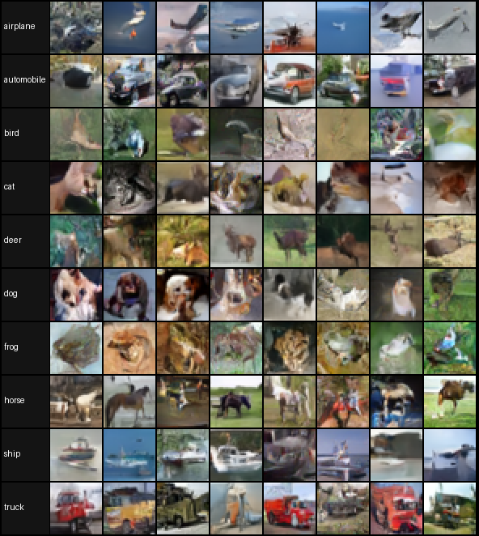
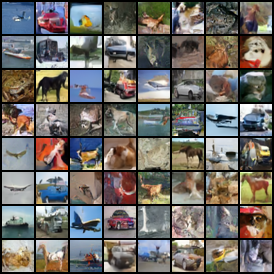

# Modular Flow Matching

<p align="right">
<a href="README.md">English</a> | 中文
</p>

这是一个紧凑的 Flow Matching 实践项目，把 Rectified Flow、条件速度预测和 ODE 采样映射到小而清晰的 PyTorch 模块中。

```text
高斯噪声（+可选类别标签）-> 学到的速度场 -> CIFAR10 图像
```

仓库面向学习和实验：概率路径、回归目标、速度预测骨干网络和数值采样器都保持可见、可替换。

环境、数据准备、训练和采样命令见 [Documentation](Documentation/README.md)。

## 基本想法

Flow Matching 学习一个连续时间速度场，把简单的源分布搬运到数据分布：

```math
\frac{d x_t}{d t} = v_\theta(x_t, t).
```

生成从标准高斯噪声开始，沿着这个学到的 ODE 从 `t=0` 积分到 `t=1`：

```math
x_0 \sim \mathcal{N}(0, I),
\qquad
x_1 \sim p_{\mathrm{data}}.
```

网络预测的不是离散的反向转移，而是当前位置上的速度。采样器再决定如何对这个速度场进行积分。

从整个分布看，这条路径把高斯源分布连接到数据分布：

```math
p_0(x)=\mathcal{N}(0,I),
\qquad
p_1(x)=p_{\mathrm{data}}(x).
```

随时间变化的密度和速度场满足连续性方程：

```math
\frac{\partial p_t(x)}{\partial t}
+
\nabla\cdot\left(p_t(x)v_t(x)\right)
=0.
```

概率质量不会凭空产生或消失，只会在速度场的推动下移动；Flow Matching 学习的就是产生这个概率流的速度场。

## 线性概率路径

最简单的路径独立采样一个噪声 `z` 和一个数据样本 `x`，再在二者之间线性插值：

```math
z \sim \mathcal{N}(0, I),
\qquad
x \sim p_{\mathrm{data}}.
```

```math
x_t = (1-t)z + tx.
```

两个端点分别是 `x_0=z` 和 `x_1=x`。对路径求时间导数得到条件目标速度：

```math
u_t = \frac{d x_t}{d t} = x-z.
```

这条直线路径就是最简单的 Rectified Flow：`x_0=z`、`x_1=x`，条件速度恒为 `x_1-x_0`。

路径构造实现在 [`flow/paths.py`](flow/paths.py)。

## 训练目标

每次训练都会采样真实图像、高斯噪声和均匀随机时间。网络接收插值点 `x_t`，并回归路径速度：

```math
x\sim p_{\mathrm{data}},
\qquad
z\sim\mathcal{N}(0,I),
\qquad
t\sim U(0,1).
```

```math
\mathcal{L}_{\mathrm{FM}}
=
\mathbb{E}_{x,z,t}
\left[
\left\|
v_\theta(x_t,t) - (x-z)
\right\|^2
\right].
```

目标取决于采样的 `(x,z)` 配对，而模型只能看到 `(x_t,t)`。在均方误差下，最优预测因此是条件期望：

```math
v^*(x_t,t)
=
\mathbb{E}
\left[
x-z \mid x_t,t
\right].
```

loss 封装在 [`flow/losses.py`](flow/losses.py)，训练循环位于 [`train.py`](train.py)。

## 采样

采样从高斯噪声开始，对学到的速度场进行数值积分：

```math
\frac{d x_t}{d t}=v_\theta(x_t,t),
\qquad
t:0\rightarrow1.
```

项目支持 Euler 和 Heun 两种积分方法。Euler 每步评估一次速度，Heun 则使用预测—校正更准确地更新轨迹。步数更多时轨迹通常更平滑，步数更少时生成更快。

ODE 采样器实现在 [`flow/sampler.py`](flow/sampler.py)。

## 这个项目实现了什么

实验在 pixel space 中使用归一化的 CIFAR10 图像：

```math
x \in \mathbb{R}^{3\times32\times32}.
```

同一个 UNet 可以进行无条件训练，也可以额外接收 CIFAR10 类别标签：

```math
v_\theta(x_t,t),
\qquad
v_\theta(x_t,t,y).
```

在 class-conditional 训练中，class embedding 会加到 time embedding 上，并注入 UNet 的残差块。采样可以循环类别、指定单一类别，或生成每行一个类别的网格。

| 组件 | 实现 |
| --- | --- |
| 线性概率路径 | [`flow/paths.py`](flow/paths.py) |
| Flow Matching loss | [`flow/losses.py`](flow/losses.py) |
| Euler 和 Heun 采样器 | [`flow/sampler.py`](flow/sampler.py) |
| 条件 UNet | [`models/unet.py`](models/unet.py) |
| 训练入口 | [`train.py`](train.py) |
| 采样入口 | [`sample.py`](sample.py) |

## 和邻近方法的关系

| 方法 | 学习对象 | 生成方式 |
| --- | --- | --- |
| VAE | latent posterior、prior 和 decoder | 采样 latent 后解码 |
| Diffusion | noise、score、data 或 velocity prediction | reverse SDE、ODE 或离散去噪链 |
| Flow Matching | 连续速度场 | 从噪声出发解 ODE |
| 本项目 | pixel-space 条件速度场 | 在 CIFAR10 上进行 Euler 或 Heun 积分 |

Diffusion 中的 velocity prediction 通常从预先规定的加噪路径出发：

```math
x_t=\alpha_t x_0+\sigma_t\epsilon,
\qquad
v=\alpha_t\epsilon-\sigma_t x_0.
```

它是 diffusion 框架内部的一种预测目标参数化。对于这里的直线 Flow Matching 路径，velocity 则直接是概率路径的时间导数：

```math
x_t=(1-t)z+tx,
\qquad
v=x-z.
```

## 结果

下面是已完成的 CIFAR10 class-conditional 实验在 [`assets/results/`](assets/results) 中的定性结果。

训练脚本和一键流程会把生成样本写入：

```text
runs/cifar10_fm/samples/
runs/full_pipeline/conditional/samples/
runs/full_pipeline/unconditional/samples/
```

### 按类别排列的条件生成

每一行对应一个 CIFAR10 类别。



### 第 100 个 Epoch 的训练采样



常见的生成结果包括：

| 结果 | 用途 | 默认文件名 |
| --- | --- | --- |
| Class grid | 每行一个 CIFAR10 类别 | `class_grid_euler_050.png` |
| Class cycle | 快速检查条件控制是否生效 | `class_cycle_euler_050.png` |
| Single class | 指定单一类别，例如 `cat` | `class_3_euler_050.png` |
| Unconditional | 无条件模型的生成结果 | `samples_euler_050.png` |
| Trajectory | 从噪声到图像的 ODE 过程 | `*.gif` |

## 小结

Flow Matching 把生成过程分成三件事：概率路径规定噪声和数据如何连接，网络学习路径速度，ODE 求解器再把速度场转换成生成样本。

VAE 采样 latent 后解码；Diffusion 学习反向去噪过程；Flow Matching 学习把噪声连续搬运到数据的速度场。

```math
x_t=(1-t)z+tx,
\qquad
u_t=x-z.
```

```math
\mathrm{sample}
=
\mathrm{ODESolver}\left(v_\theta,x_0\right),
\qquad
x_0\sim\mathcal{N}(0,I).
```
